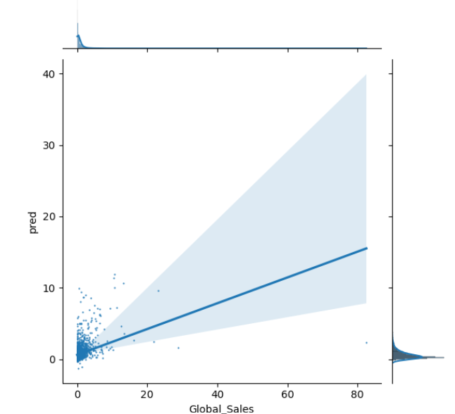
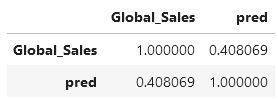
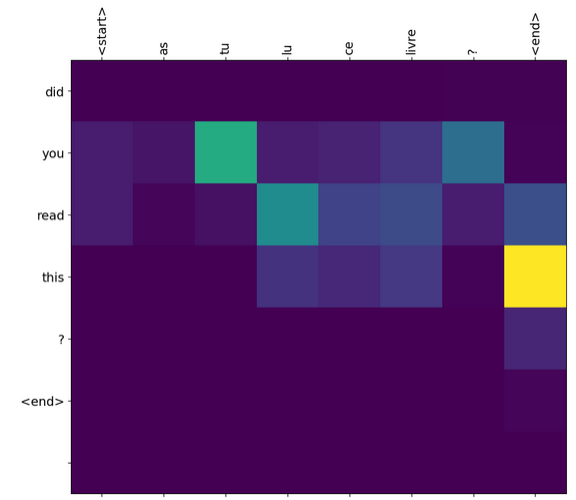

# mike-el.github.io

# Mike Elliott
## Data science portfolio

 - Weather and climate modelling
 - Artificial Intelligence: Natural Language Processing
 - XGBoost for predictive modelling
   
## Project: Weather data cube
Using the Met Office IRIS package, open a cube that contains many years worth of the Hadley sea surface temperature anomaly data, explore the dimensions and their ranges, select the most recent time slice, then visualise the latest 2023 anomaly global picture using a color-brewer palette with coastlines displayed on a filled contour plot:

The data are in NetCDF format, which is a standard data format for climate data. The Hadley sea surface temperature anomaly data spans 1850 - 2023.

## Project: Climate extremes
Using a long time series of multi-dimensional weather station data, load into a dataframe, remove missing numbers and non-numeric identifiers (eg estimated data), classify each month of the time series as an outlier or not based on the K nearest neighbours clustering algorithm, then use the seaborn package to visualise the multi-dimensional data set with points labelled orange if they are classed as an outlier or not.

Our historic station data consists of:

 - Mean daily maximum temperature (tmax)
 - Mean daily minimum temperature (tmin)
 - Days of air frost (af)
 - Total rainfall (rain)
 - Total sunshine duration (sun) - This is only recorded from 1929 onwards.

The scatter plot matrix is really useful. It shows:
 - bimodal distributions for temperature and sunshine
 - strong correlations of temperature min and max
 - strong correlations of tmax with sun_hrs and air_frost_days
 - the outliers (orange points) are not just high and low values in one or two variables. Instead they can be seen to be scattered amongst all the dimensions, suggesting that the algorithm has successfully identified multidimensional outliers
 - the scatterplot of sun_hrs and rain_mm is perhaps the most interesting with extreme values existing in all the edges of the chart, except for low rain_mm.

With access to similar daily data, it should be possible to build a model that can predict climate extremes before they occur. The monthly time resolution of the available dataset is likely to stop a forecasting model being useful.

## Project: Forecasting with a boosted decision tree: XGBoost algorithm
Using a standard "video games" data set that contains columns like: sales volumes; critic and user scores; year of release; genre.

The project objective I set myself was a hard one
 - 'Critic_Score','Critic_Count','User_Score','User_Count','Rating','Year_of_Release' - the candidate explanatory variables.
 - 'Global_Sales' - the variable we want to predict.

The data (after extensive data munging) was like this, with 1 row per game:

Use hold-out validation to assess the forecast accuracy. See a scatter plot below of predictions vs actual global sales:

The correlation between the predicted global sales and actual was 0.38, ie medium strength.

Then I used a randomised search approach to quickly (it took 9s) optimise the XGBoost parameters and repeated the XGBoost forecast. The correlation had improved slightly to r = 0.41.

## Project: Artificial Intelligence - Natural Language Processing

I have been working on using AI for NLP and have worked through an increasingly advanced set of NLP projects (Simple RNN, LSTMs, GRUs, BI-Directional RNNs, Seq2Seq Model Architecture aka Encoder-Decoder Models, Attention Models, Transformers, Hugging Face text summarisation, pytorch T5 text summarisation). Here I present an example of an Attention model I had trained to be used for language translation from French to English. 

Without access to high performance computing I was forced to reduce training sample size and durations which lead to reduced model performance, nevertheless the attention model performed well enough to confirm it was working. See the example attention translation diagram below of the trained model.

